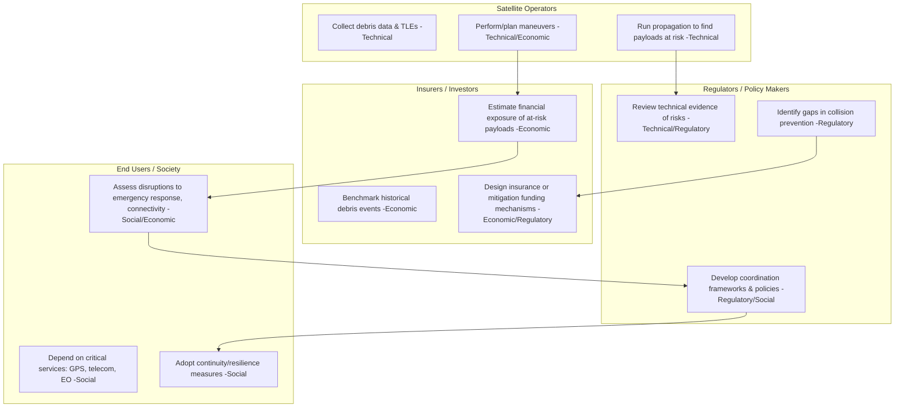

# Space Traffic Management Timeline

Key Features
Lanes = Stakeholders:
Operators → run data + maneuvers.
Regulators → coordinate rules + policies.
Insurers → model financial risk & create instruments.
End-users → feel the societal/economic impact.
Tagged Themes: Each task explicitly links to Technical / Regulatory / Economic / Social.

Flows:
Operator analysis feeds regulators (for policy) and insurers (for cost).

Insurer risk models inform social impact awareness.

Social disruptions loop back into policy needs.
