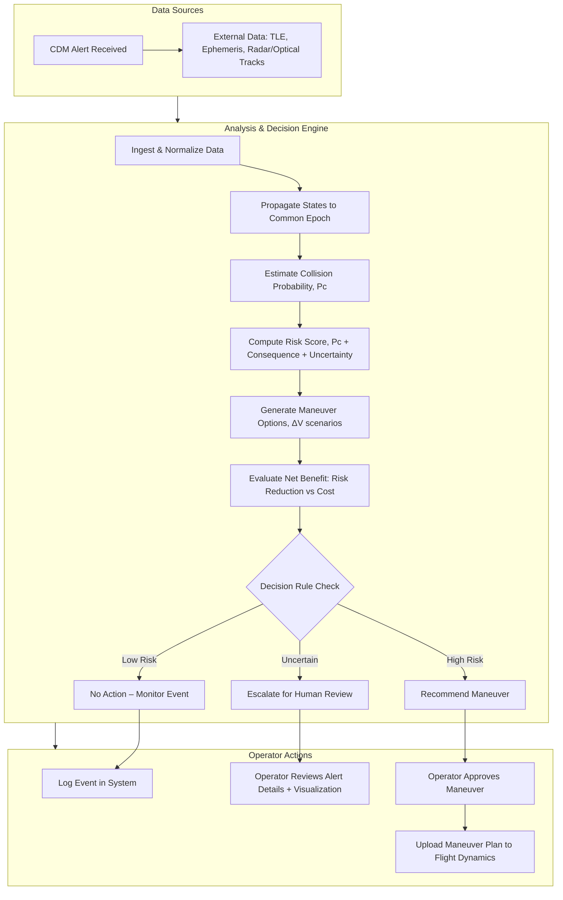

# Conjunction Risk Response

```mermaid

flowchart TD
    %% Lanes: Data Sources, Analysis Engine, Operator
    
    subgraph DS[Data Sources]
        A1[CDM Alert Received] --> A2[External Data: TLE, Ephemeris, Radar/Optical Tracks]
    end
    
    subgraph AE[Analysis & Decision Engine]
        B1[Ingest & Normalize Data] --> B2[Propagate States to Common Epoch]
        B2 --> B3[Estimate Collision Probability, Pc]
        B3 --> B4[Compute Risk Score, Pc + Consequence + Uncertainty]
        B4 --> B5[Generate Maneuver Options, ΔV scenarios]
        B5 --> B6[Evaluate Net Benefit: Risk Reduction vs Cost]
        B6 --> B7{Decision Rule Check}
        B7 -->|Low Risk| B8[No Action – Monitor Event]
        B7 -->|Uncertain| B9[Escalate for Human Review]
        B7 -->|High Risk| B10[Recommend Maneuver]
    end
    
    subgraph OP[Operator Actions]
        B8 --> C1[Log Event in System]
        B9 --> C2[Operator Reviews Alert Details + Visualization]
        B10 --> C3[Operator Approves Maneuver]
        C3 --> C4[Upload Maneuver Plan to Flight Dynamics]
    end
    
    %% Data flow connections
    DS --> AE --> OP

```
