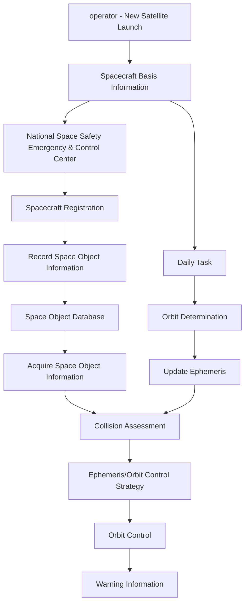

# Conjunction Risk Response Overview

```mermaid

flowchart TD
    A[operator - New Satellite Launch] --> B[Spacecraft Basis Information]
    B --> C[National Space Safety Emergency & Control Center]

    C --> D[Spacecraft Registration]
    D --> E[Record Space Object Information]
    E --> F[Space Object Database]

    F --> G[Acquire Space Object Information]
    G --> H[Collision Assessment]

    B --> I[Daily Task]
    I --> J[Orbit Determination]
    J --> K[Update Ephemeris]
    K --> H
    H --> L[Ephemeris/Orbit Control Strategy]
    L --> M[Orbit Control]
    M --> N[Warning Information]


```
