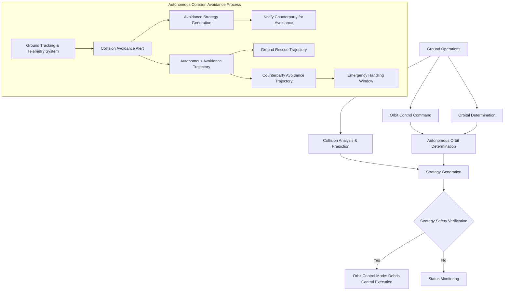

# Conjunction Risk Response Operator Overview

```mermaid

flowchart TD
    A[Ground Operations] --> B[Orbit Control Command]
    A --> C[Orbital Determination]
    A --> D[Collision Analysis & Prediction]
    B --> E[Autonomous Orbit Determination]
    C --> E
    D --> F[Strategy Generation]
    E --> F
    F --> G{Strategy Safety Verification}
    G -->|Yes| H[Orbit Control Mode: Debris Control Execution]
    G -->|No| I[Status Monitoring]


    %% Autonomous Collision Avoidance Process
    subgraph J[Autonomous Collision Avoidance Process]
        J1[Ground Tracking & Telemetry System] --> J2[Collision Avoidance Alert]
        J2 --> J3[Avoidance Strategy Generation]
        J3 --> J4[Notify Counterparty for Avoidance]
        J2 --> J5[Autonomous Avoidance Trajectory]
        J5 --> J6[Ground Rescue Trajectory]
        J5 --> J7[Counterparty Avoidance Trajectory]
        J7 --> J8[Emergency Handling Window]
    end


```
