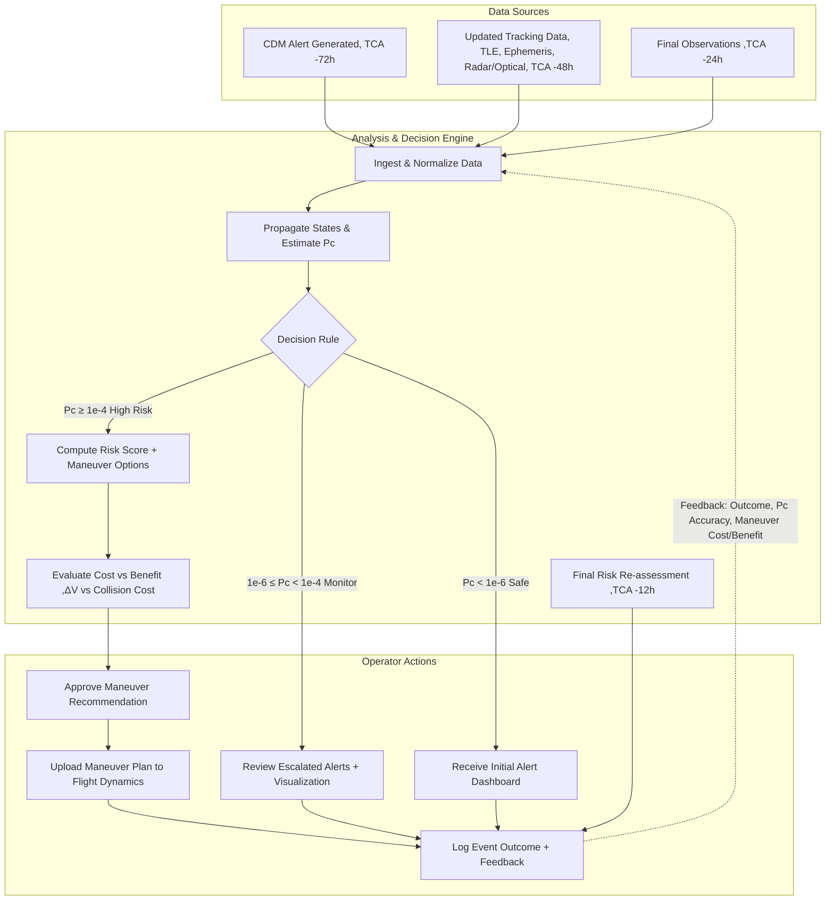

#CRR Swinlane

```mermaid

%% Swimlane Timeline for CDM Event Handling with Feedback Loop
flowchart TD
    %% Data Sources
    subgraph DS[Data Sources]
        A1[CDM Alert Generated, TCA -72h]
        A2[Updated Tracking Data, TLE, Ephemeris, Radar/Optical, TCA -48h]
        A3[Final Observations ,TCA -24h]
    end

    %% Analysis Engine
    subgraph AE[Analysis & Decision Engine]
        B1[Ingest & Normalize Data]
        B2[Propagate States & Estimate Pc]
        B3{Decision Rule}
        B4[Compute Risk Score + Maneuver Options]
        B5[Evaluate Cost vs Benefit ,ΔV vs Collision Cost]
        B6[Final Risk Re-assessment ,TCA -12h]
    end

    %% Operator
    subgraph OP[Operator Actions]
        C1[Receive Initial Alert Dashboard]
        C2[Review Escalated Alerts + Visualization]
        C3[Approve Maneuver Recommendation]
        C4[Upload Maneuver Plan to Flight Dynamics]
        C5[Log Event Outcome + Feedback]
    end

    %% Flow Connections
    A1 --> B1
    A2 --> B1
    A3 --> B1
    B1 --> B2 --> B3
    B3 -->|Pc < 1e-6 Safe| C1
    B3 -->|1e-6 ≤ Pc < 1e-4 Monitor| C2
    B3 -->|Pc ≥ 1e-4 High Risk| B4 --> B5 --> C3 --> C4
    C4 --> C5
    C2 --> C5
    C1 --> C5
    B6 --> C5

    %% Feedback Loop
    C5 -. Feedback: Outcome, Pc Accuracy, Maneuver Cost/Benefit .-> B1


```
