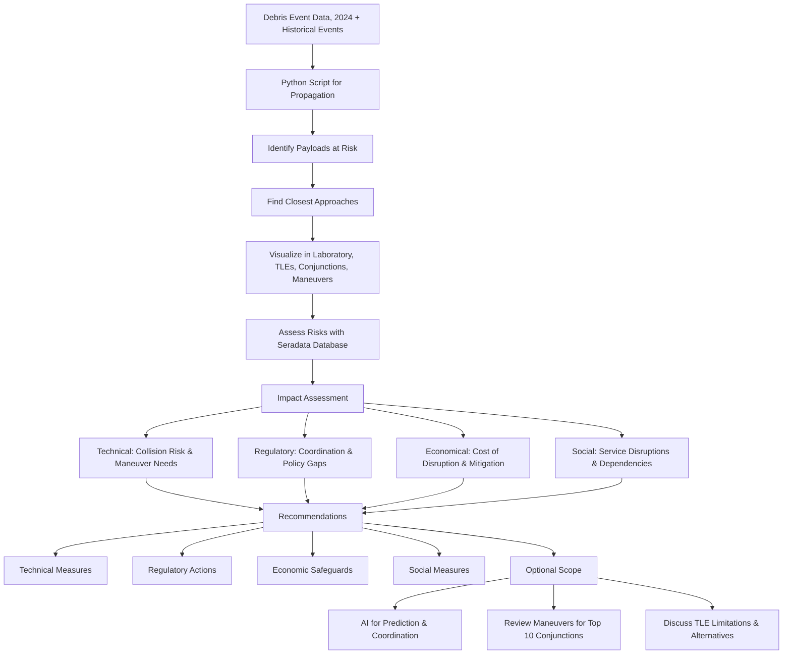

# Space Traffic Management

```mermaid
flowchart TD
    A[Debris Event Data, 2024 + Historical Events] --> B[Python Script for Propagation]
    B --> C[Identify Payloads at Risk]
    C --> D[Find Closest Approaches]
    D --> E[Visualize in Laboratory, TLEs, Conjunctions, Maneuvers]
    E --> F[Assess Risks with Seradata Database]
    F --> G[Impact Assessment]
    
    G --> G1[Technical: Collision Risk & Maneuver Needs]
    G --> G2[Regulatory: Coordination & Policy Gaps]
    G --> G3[Economical: Cost of Disruption & Mitigation]
    G --> G4[Social: Service Disruptions & Dependencies]

    G1 & G2 & G3 & G4 --> H[Recommendations]
    H --> H1[Technical Measures]
    H --> H2[Regulatory Actions]
    H --> H3[Economic Safeguards]
    H --> H4[Social Measures]

    H --> I[Optional Scope]
    I --> I1[AI for Prediction & Coordination]
    I --> I2[Review Maneuvers for Top 10 Conjunctions]
    I --> I3[Discuss TLE Limitations & Alternatives]
```
