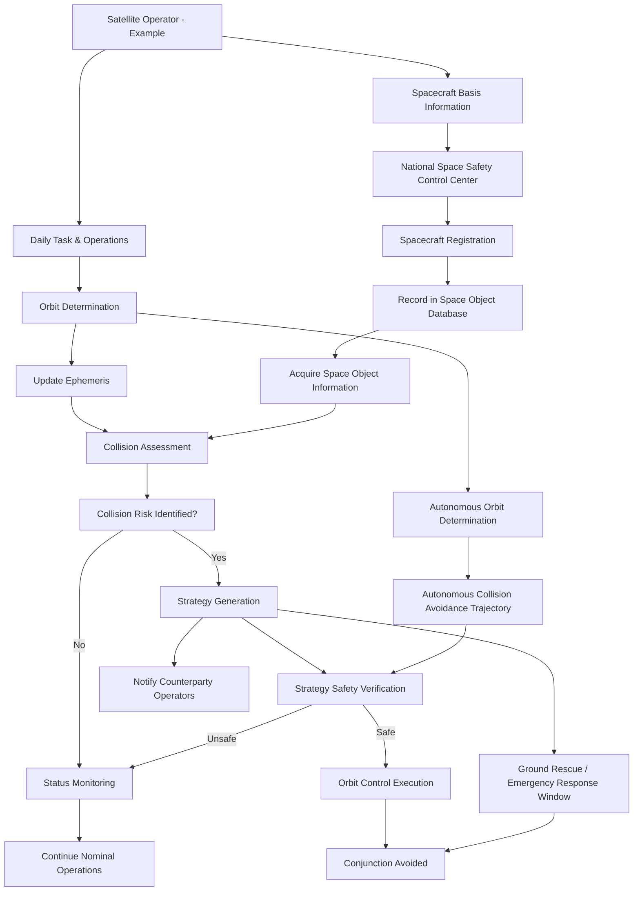

# Operator View for Conjunction Risk Response

```mermaid
flowchart TD
    %% Operator Layer
    A[Satellite Operator - Example] --> B[Spacecraft Basis Information]
    B --> C[National Space Safety Control Center]
    A --> D[Daily Task & Operations]
    D --> E[Orbit Determination]
    E --> F[Update Ephemeris]
    F --> H[Collision Assessment]

    %% National Authority
    C --> G[Spacecraft Registration]
    G --> I[Record in Space Object Database]
    I --> J[Acquire Space Object Information]
    J --> H

    %% Collision Assessment & Strategy
    H --> K[Collision Risk Identified?]
    K -->|Yes| L[Strategy Generation]
    K -->|No| M[Status Monitoring]

    L --> N[Strategy Safety Verification]
    N -->|Safe| O[Orbit Control Execution]
    N -->|Unsafe| M

    %% Coordination
    L --> P[Notify Counterparty Operators]
    L --> Q[Ground Rescue / Emergency Response Window]

    %% Autonomous Layer
    E --> R[Autonomous Orbit Determination]
    R --> S[Autonomous Collision Avoidance Trajectory]
    S --> N

    %% Outcomes
    O --> T[Conjunction Avoided]
    Q --> T
    M --> U[Continue Nominal Operations]


```
